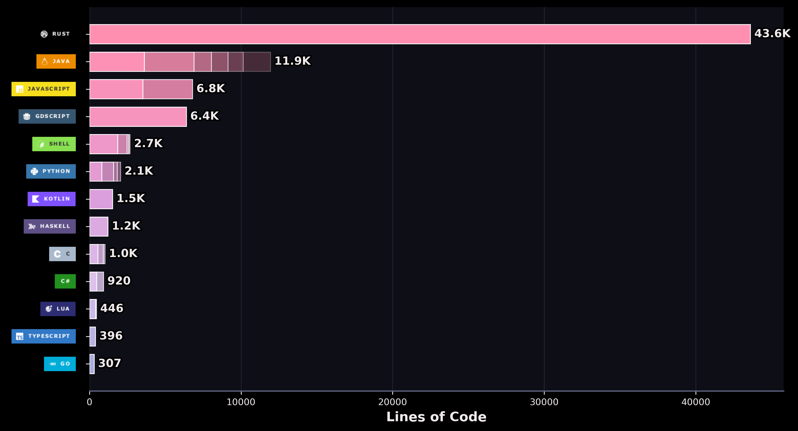

  

<h1 align="center">Greetings mortal&nbsp; ( ꈍᴗꈍ)❣️</h1>

### 🧉 Keep it simple

- [x] Graduated with an MSc in Software Engineering
- [ ] Opening my indie game dev studio [Ashfall](https://ashfallsoftware.com) — currently building our first video game ⚔️
- [x] ~Worked for Amazon, lived in Seattle~ — chapter closed
- [x] Born and raised in Ciudad Juárez, Chihuahua, México ⇄ El Paso, Texas
- [x] Always up for connecting, contributing and learning new stuff — cool idea or just wanna chat? Send me a message!

  

## 🌸 Languages I Write

<!-- ✿ languages:start ✿ -->

<!-- ✿ auto-generated nightly by the stats workflow (lines of code across my repos) — hands off, mortal ✿ -->

|    | Language | Lines of code | Share |
|:--:|:---------|----------:|:------|
| 🥇 | Rust | 63.7K | 🌸🌸🌸🌸🌸🌸🌸🌸🌸🌸 35.4% |
| 🥈 | TypeScript | 33.3K | 🌸🌸🌸🌸🌸⬜⬜⬜⬜⬜ 18.5% |
| 🥉 | Python | 26.0K | 🌸🌸🌸🌸⬜⬜⬜⬜⬜⬜ 14.5% |
| 🌸 | JavaScript | 21.0K | 🌸🌸🌸⬜⬜⬜⬜⬜⬜⬜ 11.7% |
| 🌸 | Java | 11.9K | 🌸🌸⬜⬜⬜⬜⬜⬜⬜⬜ 6.6% |
| 🌸 | Shell | 9.6K | 🌸🌸⬜⬜⬜⬜⬜⬜⬜⬜ 5.3% |
| 🌸 | GDScript | 6.4K | 🌸⬜⬜⬜⬜⬜⬜⬜⬜⬜ 3.6% |
| 🌸 | Lua | 3.0K | 🌸⬜⬜⬜⬜⬜⬜⬜⬜⬜ 1.6% |
|    | other 🌱 | 5.0K | 🌸⬜⬜⬜⬜⬜⬜⬜⬜⬜ 2.8% |
<!-- ✿ languages:end ✿ -->

## 📫 Ping Me

  
  
  
  

🌸 the lore — click to expand

 

> **"Oh, my new outfit is all wet!"** — the sailor above has guarded this profile for a while. No, I will not be taking questions. 🌊

- 🖥️ **the console up top** is a hand-crafted SVG animated with SMIL — no external typing service, just pure pink math
- 🎨 **the palette** is my `tsunderick` Omarchy theme — sakura pinks on void black, single source of truth
- 📊 **the stats are real** — a nightly GitHub Action counts actual lines of code across my repos, repaints the chart, and re-blooms the flower table while mortals sleep

