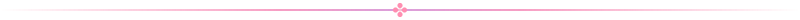

<h1 align="center">🧉 Keep it Simple</h1>

  

<h2 align="center">🖱️ Languages I Write</h2>

<!-- ✿ languages:start ✿ -->

<!-- ✿ auto-generated nightly by the stats workflow (lines of code across my repos) — hands off, mortal ✿ -->

|    | Language | Lines of code | Share |
|:--:|:---------|----------:|:------|
| 🥇 | Rust | 43.7K | 🌸🌸🌸🌸🌸🌸🌸🌸🌸🌸 55.1% |
| 🥈 | Java | 11.9K | 🌸🌸🌸⬜⬜⬜⬜⬜⬜⬜ 15.0% |
| 🥉 | JavaScript | 6.8K | 🌸🌸⬜⬜⬜⬜⬜⬜⬜⬜ 8.6% |
| 🌸 | GDScript | 6.4K | 🌸⬜⬜⬜⬜⬜⬜⬜⬜⬜ 8.0% |
| 🌸 | Shell | 2.7K | 🌸⬜⬜⬜⬜⬜⬜⬜⬜⬜ 3.4% |
| 🌸 | Python | 2.1K | 🌸⬜⬜⬜⬜⬜⬜⬜⬜⬜ 2.6% |
| 🌸 | Kotlin | 1.5K | 🌸⬜⬜⬜⬜⬜⬜⬜⬜⬜ 1.9% |
| 🌸 | Haskell | 1.2K | 🌸⬜⬜⬜⬜⬜⬜⬜⬜⬜ 1.5% |
|    | other 🌱 | 3.1K | 🌸⬜⬜⬜⬜⬜⬜⬜⬜⬜ 3.9% |

<!-- ✿ languages:end ✿ -->

<h2 align="center">📫 Ping Me</h2>

  

  
  
  
  

🌸 the lore — click to expand

 

> **"Oh, my new outfit is all wet!"** — the sailor above has guarded this profile for a while. No, I will not be taking questions. 🌊

- 🖥️ **the console up top** is a hand-crafted SVG animated with SMIL — no external typing service, just pure pink math
- 🎨 **the palette** is my `tsunderick` Omarchy theme — sakura pinks on void black, single source of truth
- 📊 **the stats are real** — a nightly GitHub Action counts actual lines of code across my repos, repaints the chart, and re-blooms the flower table while mortals sleep

