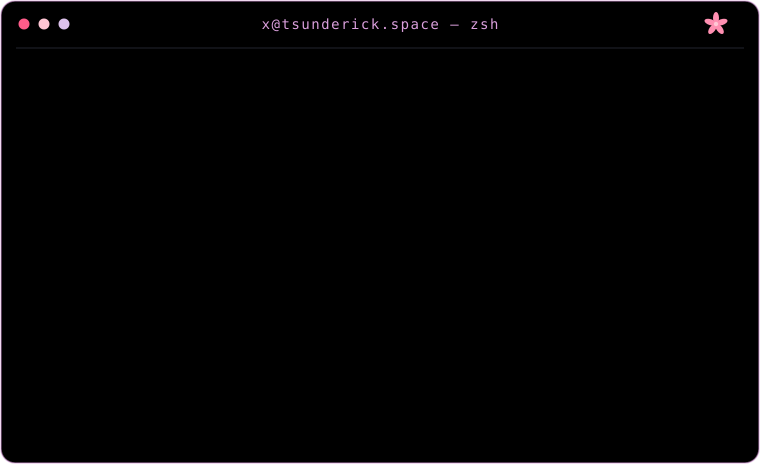

<h1 align="center">🧉 Keep it Simple</h1>

  

<h2 align="center">🖱️ Languages I Write</h2>

<!-- ✿ languages:start ✿ -->

<!-- ✿ auto-generated nightly by the stats workflow (lines of code across my repos) — hands off, mortal ✿ -->

|    | Language | Lines of code | Share |
|:--:|:---------|----------:|:------|
| 🥇 | Rust | 48.8K | 🌸🌸🌸🌸🌸🌸🌸🌸🌸🌸 54.3% |
| 🥈 | Java | 11.9K | 🌸🌸⬜⬜⬜⬜⬜⬜⬜⬜ 13.3% |
| 🥉 | Kotlin | 7.1K | 🌸⬜⬜⬜⬜⬜⬜⬜⬜⬜ 7.9% |
| 🌸 | JavaScript | 6.8K | 🌸⬜⬜⬜⬜⬜⬜⬜⬜⬜ 7.6% |
| 🌸 | GDScript | 6.1K | 🌸⬜⬜⬜⬜⬜⬜⬜⬜⬜ 6.8% |
| 🌸 | Shell | 2.6K | 🌸⬜⬜⬜⬜⬜⬜⬜⬜⬜ 2.9% |
| 🌸 | Python | 2.1K | 🌸⬜⬜⬜⬜⬜⬜⬜⬜⬜ 2.4% |
| 🌸 | Haskell | 1.2K | 🌸⬜⬜⬜⬜⬜⬜⬜⬜⬜ 1.4% |
|    | other 🌱 | 3.1K | 🌸⬜⬜⬜⬜⬜⬜⬜⬜⬜ 3.5% |

<!-- ✿ languages:end ✿ -->

  

